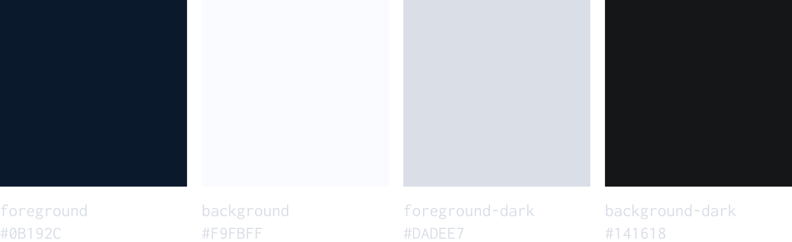
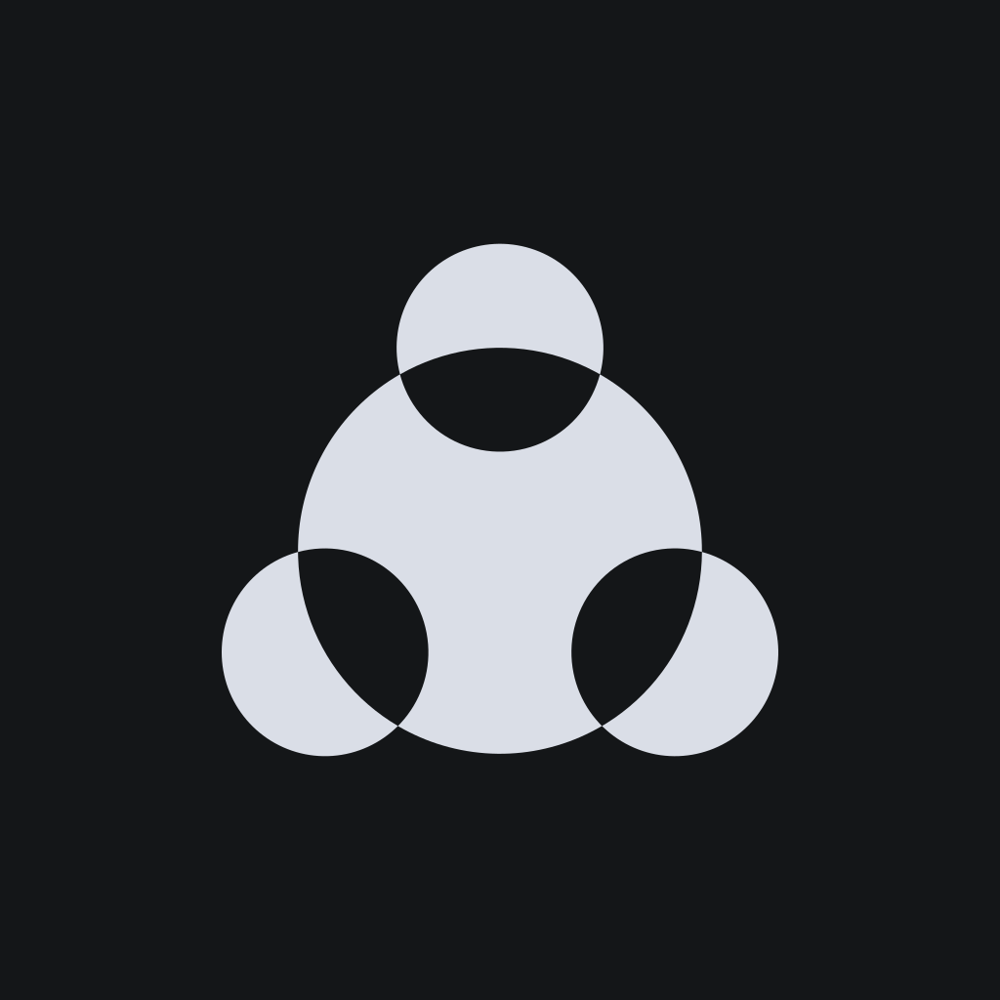
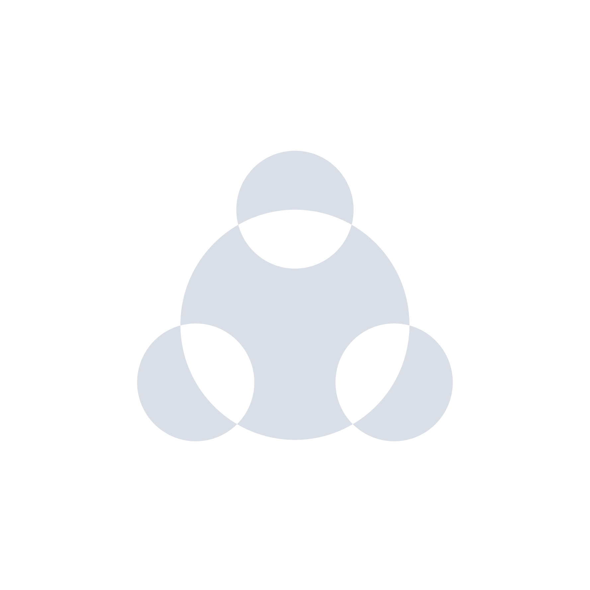
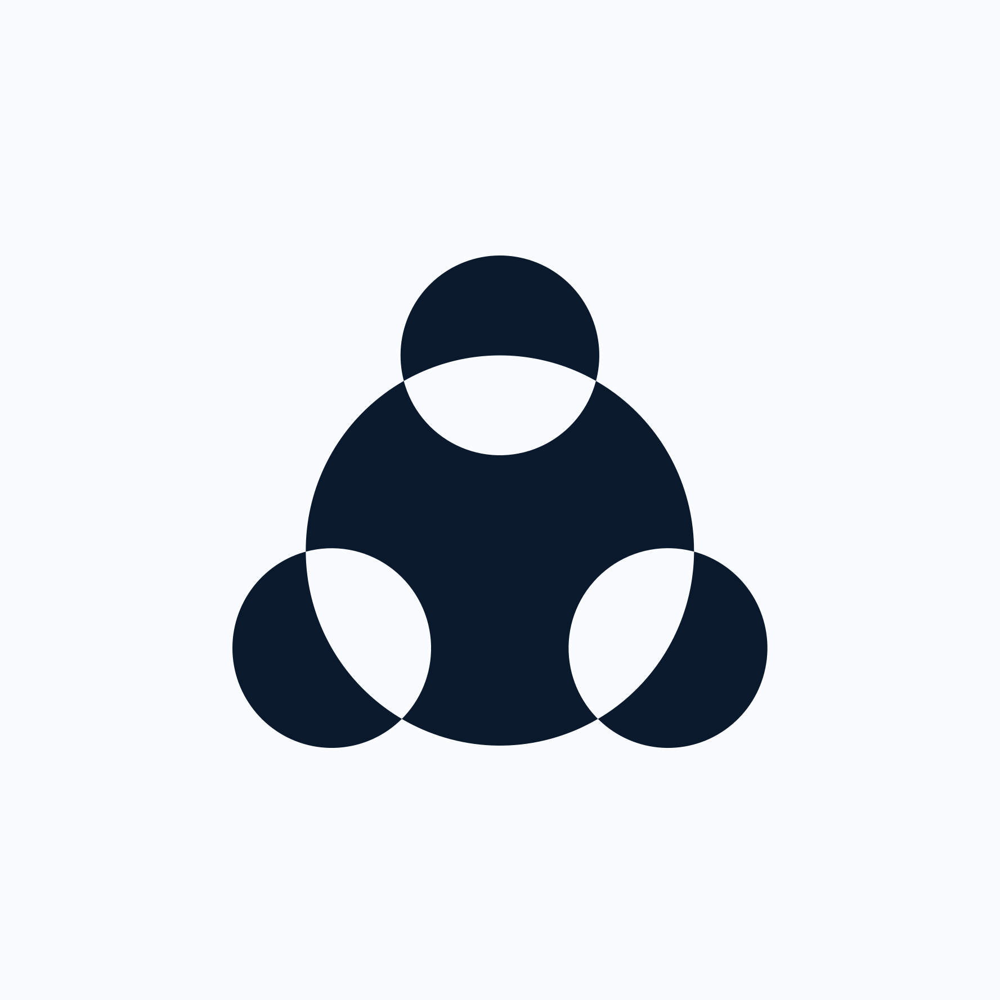
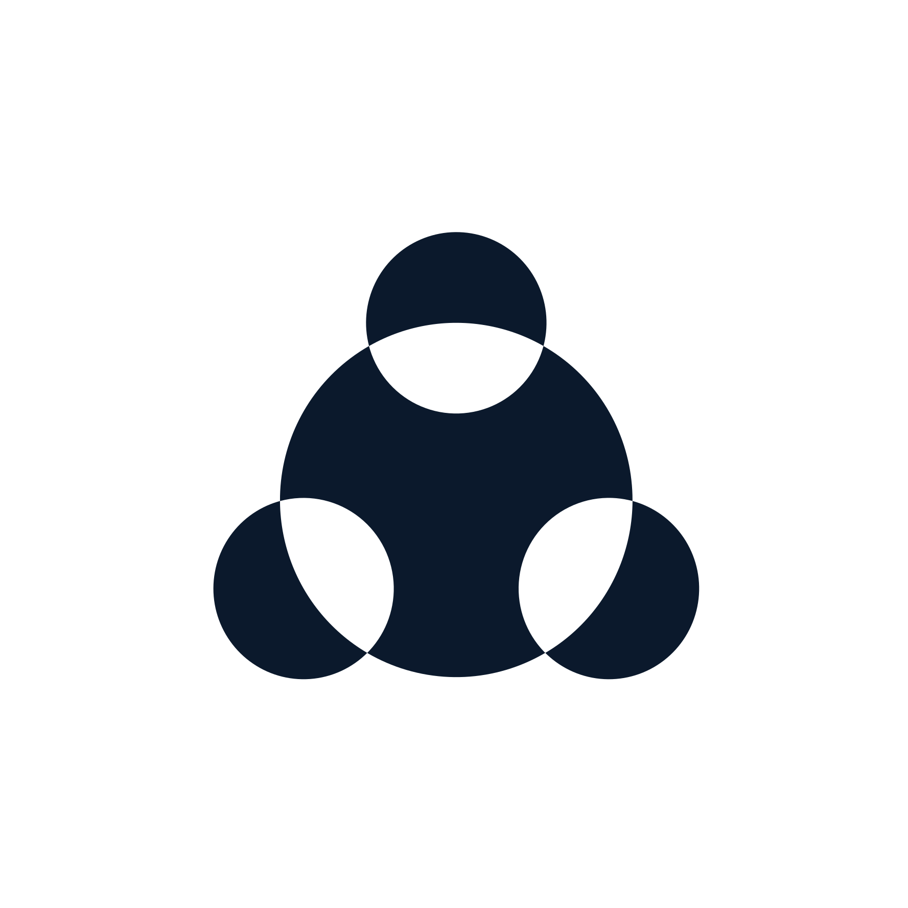
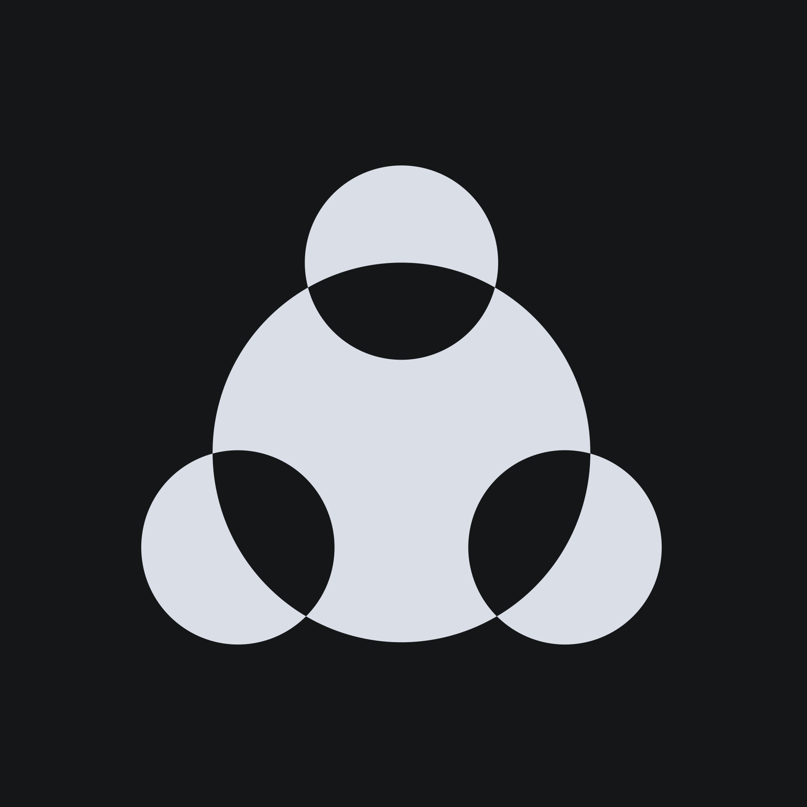
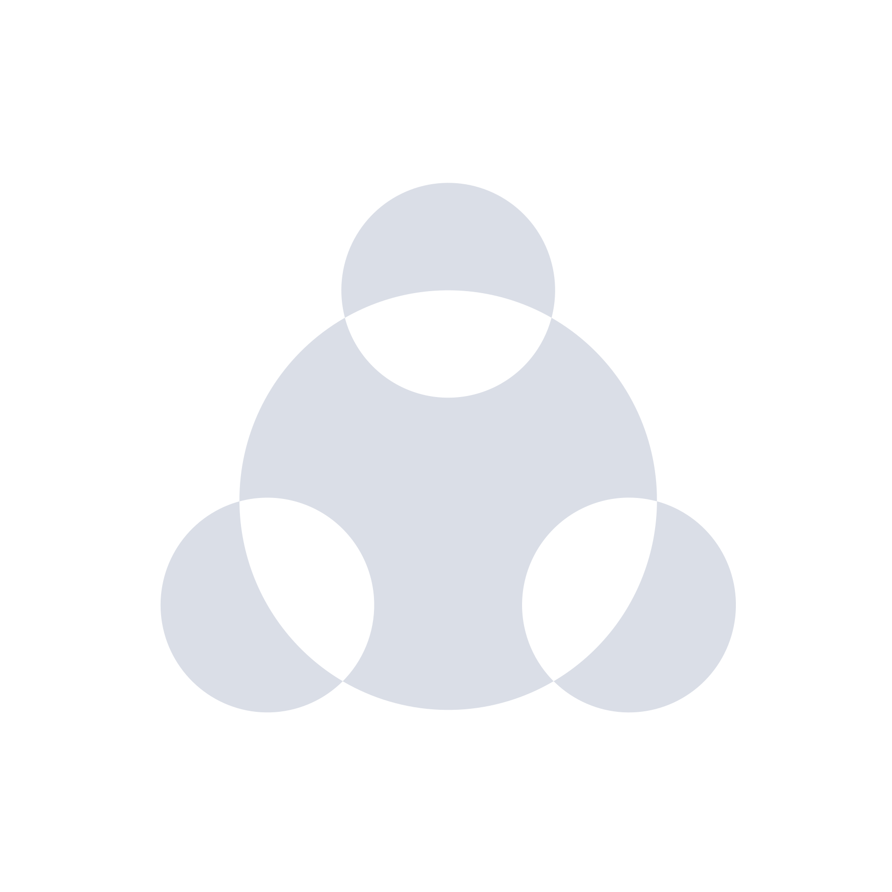
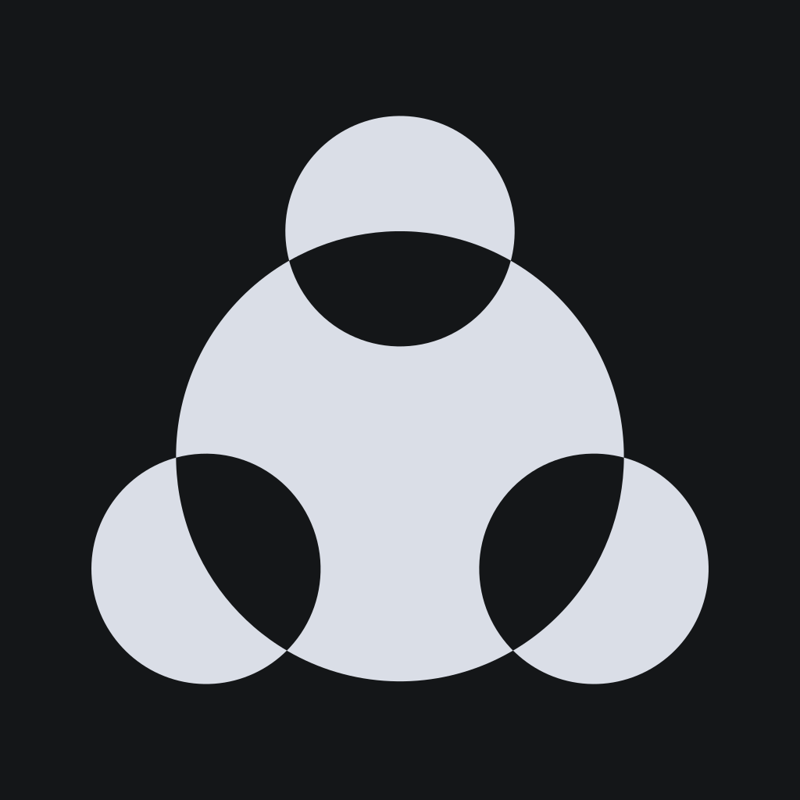
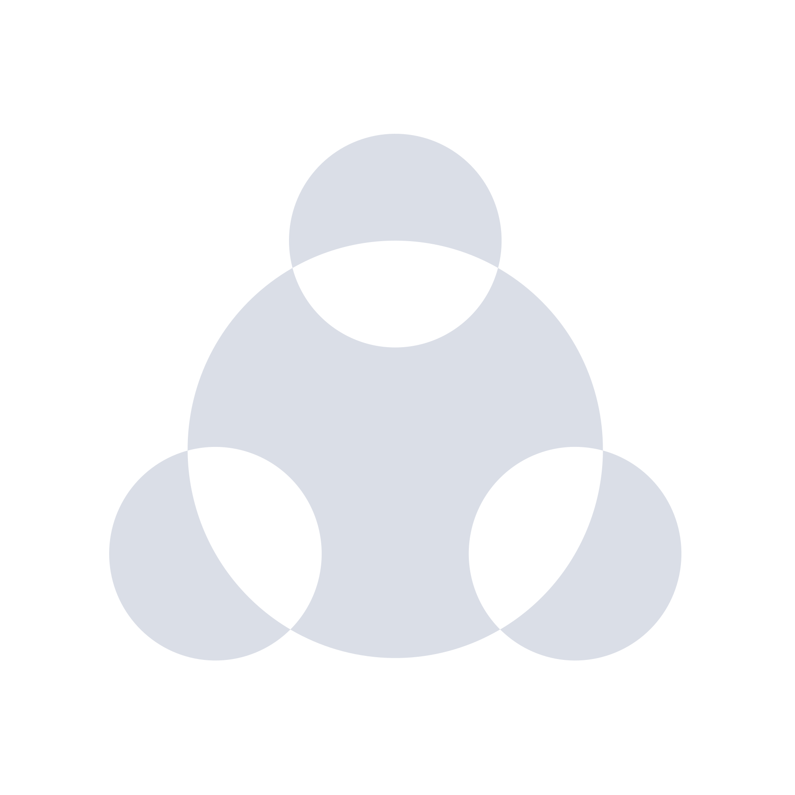

# Huddle Brand

Official Huddle logo assets, served at [brand.huddlesurety.co](https://brand.huddlesurety.com).

## Palette

## Logos

Each logo comes in three sizes (`sm`, `md`, `lg`), two themes (`dark`, `light`), and solid or `transparent` background variants.

| Preview                                                                          | Link                                                                                                               |
| -------------------------------------------------------------------------------- | ------------------------------------------------------------------------------------------------------------------ |
|                            | [brand.huddlesurety.com/logo/sm-dark.svg](https://brand.huddlesurety.com/logo/sm-dark.svg)                           |
|    | [brand.huddlesurety.com/logo/sm-dark-transparent.svg](https://brand.huddlesurety.com/logo/sm-dark-transparent.svg)   |
|                          | [brand.huddlesurety.com/logo/sm-light.svg](https://brand.huddlesurety.com/logo/sm-light.svg)                         |
|  | [brand.huddlesurety.com/logo/sm-light-transparent.svg](https://brand.huddlesurety.com/logo/sm-light-transparent.svg) |
|                            | [brand.huddlesurety.com/logo/md-dark.svg](https://brand.huddlesurety.com/logo/md-dark.svg)                           |
|    | [brand.huddlesurety.com/logo/md-dark-transparent.svg](https://brand.huddlesurety.com/logo/md-dark-transparent.svg)   |
|                          | [brand.huddlesurety.com/logo/md-light.svg](https://brand.huddlesurety.com/logo/md-light.svg)                         |
|  | [brand.huddlesurety.com/logo/md-light-transparent.svg](https://brand.huddlesurety.com/logo/md-light-transparent.svg) |
|                            | [brand.huddlesurety.com/logo/lg-dark.svg](https://brand.huddlesurety.com/logo/lg-dark.svg)                           |
|    | [brand.huddlesurety.com/logo/lg-dark-transparent.svg](https://brand.huddlesurety.com/logo/lg-dark-transparent.svg)   |
|                          | [brand.huddlesurety.com/logo/lg-light.svg](https://brand.huddlesurety.com/logo/lg-light.svg)                         |
|  | [brand.huddlesurety.com/logo/lg-light-transparent.svg](https://brand.huddlesurety.com/logo/lg-light-transparent.svg) |

> **Note:** `light` logos are designed for dark backgrounds and may be hard to see on GitHub's light theme (and vice versa for `dark`).
